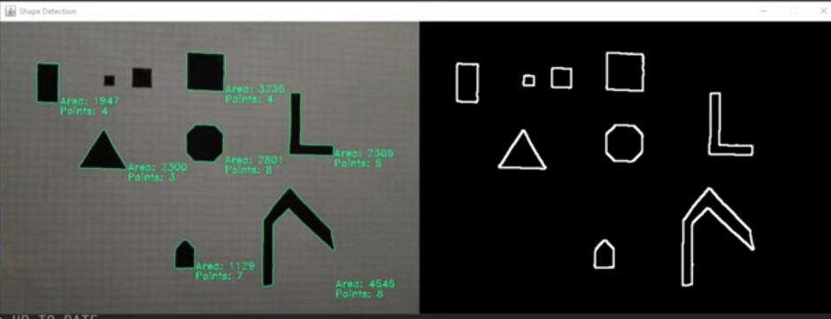

# Real-Time Shape Detection using OpenCV in Java

This project performs **real-time shape detection** from a webcam feed using **OpenCV in Java**. It detects contours of shapes, calculates the number of points (vertices), and computes the area of each detected shape in pixels, displaying the results visually on the video feed.

## Features

- Capture live video from the webcam and process frames in real-time.
- Detect contours of different shapes.
- Calculate and display:
  - **Number of points (vertices)** per detected shape.
  - **Area of each shape** in pixels.
- Display:
  - **Left panel:** Original camera feed with contours, area, and point count annotated.
  - **Right panel:** Processed image for debugging and visualization of the pipeline.

## Technology Stack

- **Java** (built in IntelliJ IDEA)
- **Gradle** for dependency management
- **OpenCV Java Library** for computer vision operations

## Processing Pipeline

1. **Capture Frames:**
   - Uses `VideoCapture` to stream frames from the default webcam.

2. **Preprocessing:**
   - Apply **Gaussian blur** to reduce noise.
   - Convert frames to **grayscale**.
   - Apply the **Canny edge detection algorithm** to find edges.
   - Use **dilation** to thicken edges for stable contour detection.

3. **Contour Detection and Filtering:**
   - Use `findContours` to detect contours in the processed frame.
   - Filter out small/noise contours by retaining only those with an area above a defined threshold (e.g., 1000 pixels).

4. **Calculating Points and Area:**
   - Use `contourArea` to compute the area of each contour.
   - Approximate each contour with `approxPolyDP` to determine the number of vertices.

5. **Display:**
   - Annotate the detected shapes with:
     - Number of vertices.
     - Area in pixels.
   - Convert `Mat` objects to `BufferedImage` for display in `JPanel` components.

## Usage

1. Ensure OpenCV is correctly installed and linked with your project.
2. Run the project from your IDE.
3. The application will open a window with:
   - **Left:** Live feed with detected shapes and annotations.
   - **Right:** Processed frame showing edges and contours.

## Customization

- Adjust **Canny thresholds**, **dilation iterations**, and **minimum area filter** based on your camera quality and environment for optimal detection.
- Extend the project for more complex pipelines like:
  - Real-time Sudoku solving.
  - Object tracking using shape and contour features.

## Notes

- Detection accuracy can vary based on lighting, camera resolution, and background complexity.
- Fine-tuning thresholds is recommended for stable detection under your specific setup.

